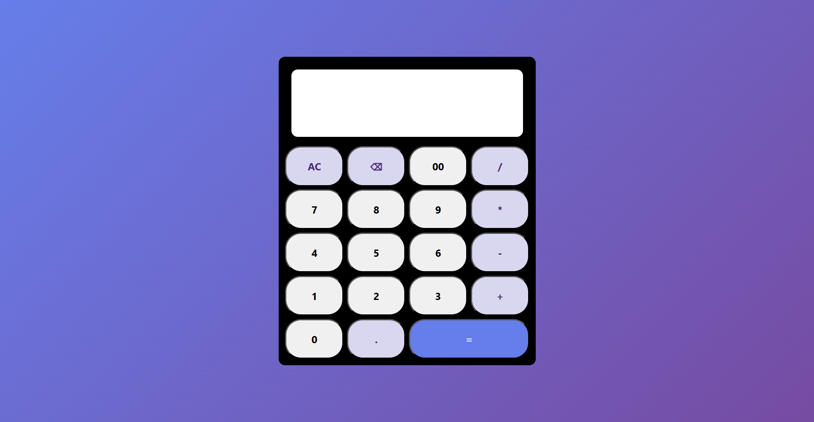

# 🧮 Simple Calculator

A clean, responsive, and user-friendly calculator built using **HTML**, **CSS**, and **JavaScript**. This project demonstrates fundamental frontend development concepts such as DOM manipulation, event handling, responsive design, and dynamic expression evaluation.

<p align="center">
  
</p>

---

## ✨ Features

* ➕ Addition
* ➖ Subtraction
* ✖ Multiplication
* ➗ Division
* 🔢 Decimal number support
* ⌫ Backspace functionality
* 🧹 Clear All (AC)
* ⚠️ Invalid expression handling
* 📱 Responsive and modern UI
* 🎨 Clean gradient-based design

---

## 🛠️ Technologies Used

* HTML5
* CSS3
* JavaScript (ES6)

---

## 📂 Project Structure

```text
calculator/
│
├── index.html
├── style.css
├── script.js
├── README.md
├── LICENSE
└── screenshots/
    └── calculator.png
```

---

## 🚀 Getting Started

### Clone the repository

```bash
git clone https://github.com/<your-username>/<repository-name>.git
```

### Navigate to the project

```bash
cd <repository-name>
```

### Run the project

Open `index.html` in your preferred web browser.

No additional installation or dependencies are required.

---

## 📸 Screenshot

<p align="center">
  
</p>

---

## 📖 Concepts Practiced

While building this project, I practiced:

* DOM Manipulation
* JavaScript Event Handling
* CSS Grid Layout
* Responsive Web Design
* String Manipulation
* Error Handling using `try...catch`
* Dynamic Expression Evaluation

---

## ⚠️ Note

This calculator currently evaluates mathematical expressions using JavaScript's `eval()` function.

While this approach is suitable for learning purposes, production applications should use a safer mathematical expression parser to avoid potential security risks.

---

## 🚀 Future Improvements

* ⌨️ Keyboard input support
* 📜 Calculation history
* 📊 Percentage (%) operation
* √ Square root
* xʸ Power operation
* 🧠 Memory functions (M+, M-, MR, MC)
* 🌙 Dark/Light theme toggle
* 🧮 Scientific calculator mode

---

## 🤝 Contributing

Contributions, suggestions, and improvements are welcome.

1. Fork the repository
2. Create a new feature branch
3. Commit your changes
4. Open a Pull Request

---

## 📄 License

This project is licensed under the MIT License.

---

## 👨‍💻 Author

**Suraj Yadav**

If you found this project helpful, consider giving it a ⭐ to support my work.
